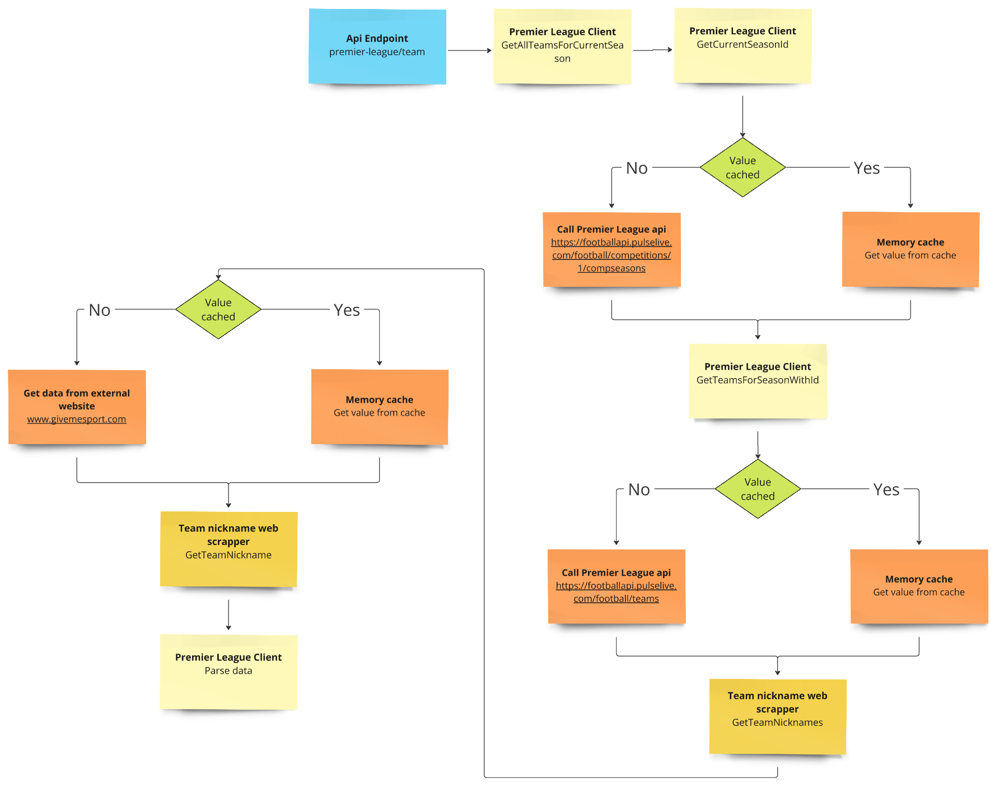

# TransferRoom Premier League 

Simple web-based POC that enables a user to select any team in the 2024/25 season of the English premier league and return the squad details for that chosen team

**Full Website is available under following address: https://delightful-sea-0ea800e03.5.azurestaticapps.net**


## How to run the application:
There are several ways to run this application:

### Using sorce code:

Navigate to the client directory and run: 
```
npm install
npm run dev
```

From main directory run:
```
dotnet run --project server/TransferRoom.Api/TransferRoom.Api.csproj --configuration Release
```

### Using docker-compose file:

From main directory where `docker-compose.yml` file is located run:
```
docker compose up
```

### Using stand alone dockerfiles:

From main directory run following commands:

To start client application:
```
docker build --build-arg VITE_API_URL=http://localhost:5041 -t transfer_room_client ./client && docker run --name transfer_room_client -p 4000:80 -it transfer_room_client
```

To start server application:
```
docker build -t transfer_room_server ./server/TransferRoom.Api && docker run -p 5041:8080 --name transfer_room_server -it transfer_room_server
```

Client application will be available under following address: http://localhost:4000/

## High level overview

Both client and server applications are hosted on Azure. Client application is hosted with a help of Azure static web apps and server with a help of Azure web apps.\
Application flow is very simple. Client application calls server that aggregates data from Premier League api and serves it back to client in appropriate shape.

## Client

### Tech Used:
 - React
 - React-Router
 - Material-UI
 - Tanstack-Query,
 - Axios

### Application preview:

#### Teams View:
Application contains two main pages. First of them is landing page with all teams in the 2024/25 season of the English premier league. User can filter teams by their name select on of them to preview all team players


#### Players View:
Second page contains various information about selected team players. Players can be filtered by their first name, last name, and position.


 User can see following information about players:
- Image
- First name
- Last name
- Position
- Birth date

## Server

### Tech Used:
 - .NET 8
 - Flurl

### Example endpoint flow Data Flow:



## Github workflows

Application has three workflows, each responsible for performing different action.

### Build
This action is invoked on every push to this repository. It is responsible for building server and client code to ensure that application compiles without any issues.

### Create release artifacts
This action is invoked every time new release has been created. It is responsible for creating release packages for client and server applications. It automatically adds them to created release as attachments

### Deploy application to azure
This action can be invoked only manually. It is responsible for building client and server applications and deploying them to Azure Web Apps. Client application can be reached under address: https://delightful-sea-0ea800e03.5.azurestaticapps.net